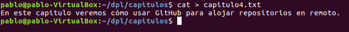
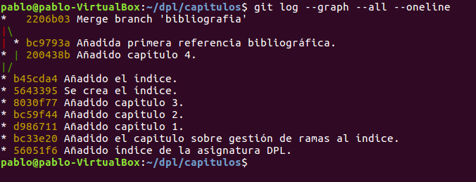
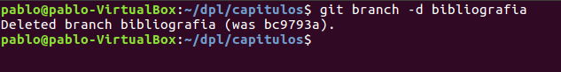
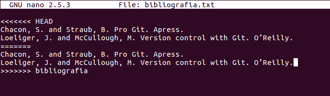

# Manipulación Avanzada en Git
## Indice
- **[Ejercicio 1](#ejercicio-1)**
- **[Ejercicio 2](#ejercicio-2)**
- **[Ejercicio 3](#ejercicio-3)**
- **[Ejercicio 4](#ejercicio-4)**
- **[Ejercicio 5](#ejercicio-5)**
- **[Ejercicio 6](#ejercicio-6)**
- **[Ejercicio 7](#ejercicio-7)**
- **[Ejercicio 8](#ejercicio-8)**
- **[Ejercicio 9](#ejercicio-9)**
## Ejercicio 1
Para el primer ejercicio lo primero que realizaremos es mostrar el historial de los cambios realizados en el repositorio con el comando **“git log”**.

Luego crearemos una carpeta , la cual llamaremos capítulos con el comando **“mkdir capitulos”**, y dentro de esta carpeta creamos el fichero capítulo1.txt con el comando **“cat > capitulo1.txt”**.

Tras esto añadiremos los cambios a la zona de intercambio con el siguiente comando: **“git add .”**.

Después de esto hacemos un commit de los cambios realizados con un mensaje con el comando **“git commit -m "Añadido capítulo 1."”**.

Cuando hayamos hecho todo volveremos a revisar el historial con el comando **“git log”**.

## Ejercicio 2
En este ejercicio creamos un nuevo fichero que llamaremos capitulo2.txt, para ello usaremos **“cat > capitulos/capitulo2.txt”**.

Lo añadimos a la zona de intercambio temporal con el comando **“git add .”**.

A continuación, realizaremos un commit de los cambios realizados recientemente con el comando **“git commit -m "Añadido capítulo 2."”**.

Finalmente mostraremos la diferenciencia entre al últimas versión y las dos versiones anteriores a esta con el comando **“git diff HEAD~2..HEAD”**.

## Ejercicio 3
Como en los anteriores ejercicios, crearemos un nuevo fichero llamado capitulo3.txt con el comando **“cat > capitulos/capitulo3.txt”**.

Ahora realizaremos un **“git add”** para añadir los cambios a la zona de intercambio temporal.

Volvemos a hacer un commit, como en ejercicios anteriores, con el comando **“git commit -m "Añadido capítulo 3."”**.

Para finalizar, mostraremos los cambios realizados entre el primer y el último repositorio. Primeramente usaremos el comando **“git log”** para poder copiar el código hash de la primera versión, el cual nos servirá para el siguiente comando, **“git diff <código hash de la primera versión>..HEAD”**.

## Ejercicio 4
Creamos, primeramente, un nuevo txt que se llame indice.txt con el comando **“cat > indice.txt”**.

Lo añadimos a la zona de intercambio temporal tras su creación **“git add .”**.

Haremos un commit de la creación del fichero con el comando **“git commit -m "Se crea el índice."”**.

A continuación, añadiremos un texto al fichero indice.txt de la siguiente manera: **“echo "Indice de los capítulos, con conceptos avanzados de git" >> indice.txt”**.

Añadimos esto último a la zona de intercambio temporal con **“git add .”**.

Ahora haremos un commit en el que se añade el cambio en el fichero de índice **“git commit -m "Añadido el índice."”**.

Finalmente, mostraremos quien ha hecho los cambios y el cambio que se ha realizado con el comando **“git annotate indice.txt”**.

## Ejercicio 5
En este ejercicio crearemos una nueva rama llamada bibliografía para ello usaremos el comando **“git branch bibliografia”**.

Finalmente para comprobar las ramas que tenemos actualmente usaremos el comando **“git branch -av”**.

## Ejercicio 6
Crearemos un nuevo fichero llamado capitulo4.txt con el comando **“cat > capitulos/capitulo4.txt”**.

Añadimos los cambios a la zona de intercambio temporal con **“git add .”**.

Haremos un commit con el comando **“git commit -m "Añadido capítulo 4."”**.

Finalmente mostraremos la historia del repositorio en el que se incluyen todas las ramas con el comando **“git log --graph --all --oneline”**.

## Ejercicio 7
Ahora nos cambiamos a la rama de bibliografía con el comando **“git checkout bibliografia”**.

A continuación, creamos el fichero bibliografia.txt con el comando **“cat > bibliografia.txt”**.

Luego lo añadimos a la zona de intercambio temporal con **“git add .”**.

Lo siguiente que haremos es un commit con el siguiente comando **“git commit -m "Añadida primera referencia bibliográfica."”**.

Finalmente, mostraremos la historia del repositorio en todas las ramas con el comando **“git log --graph --all --oneline”**.

## Ejercicio 8
En el siguiente ejercicio vamos a fusionar la rama bibliografía, creada anteriormente, con la rama master, todo esto con el comando **“git checkout master”** y **“git merge bibliografia”**.

Luego de esto  mostramos la historia del repositorio en todas las ramas mediante **“git log --graph --all --oneline”**.

Después eliminamos la rama de bibliografía con el comando **“git branch -d bibliografia”**.

Tras eliminar bibliografía volveremos a comprobar la historia del repositorio con **“git log --graph --all --oneline”**.

## Ejercicio 9
Para este último ejercicio comenzaremos creando la rama bibliografía, otra vez, esto con el comando **“git branch bibliografia”**.

Nos colocamos en la rama bibliografía con el comando **“git checkout bibliografia”**.

Luego, estando ya en la rama bibliografía, creamos el fichero bibliografia.txt mediante la siguiente sentencia **“cat > bibliografia.txt”**.

A continuación, realizaremos el primer commit del ejercicio con el comando  **“git commit -a -m "Añadida nueva referencia bibliográfica."”**.

Ahora nos cambiamos de rama y nos moveremos a la rama master de la siguiente forma **“git checkout master”**.

En esta rama creamos un fichero igual que el anterior bibliografia.txt pero le cambiaremos su contenido.

Realizamos un commit de los cambios recientes con **“git commit -a -m "Añadida nueva referencia bibliográfica."”**.

Luego fusionamos la rama master con la rama bibliografía con el comando **“git merge bibliografia”**.

Nos sale que hay conflicto con el fichero de bibliografia.txt, para solucionar editaremos su contenido con **“sudo nano bibliografia.txt”** y pondremos el mismo contenido en ambos.

Haremos un commit al solucionarlo **“git commit -a -m "Solucionado conflicto bibliografía."”**.

Para finalizar mostraremos la historia del repositorio en todas las ramas **“git log --graph --all --oneline”**.

